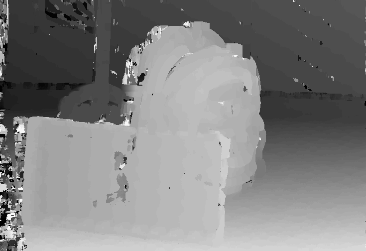
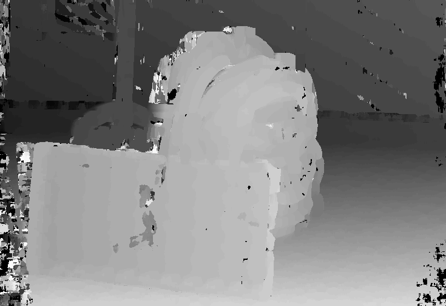
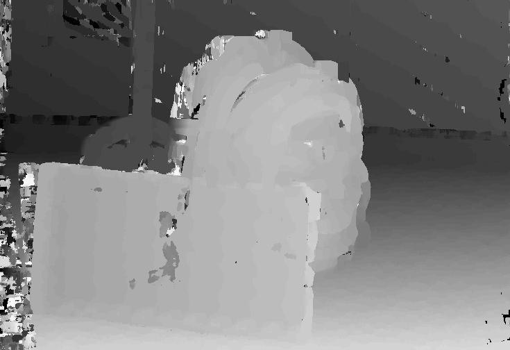

# Multiproc-openCL

This repository is for the learning purpose of GPGPU with OpenCL.

## Performance comparison

-   values are not averaged and are taken from the first run. They are not checked to be within 95% confidence interval.
    We are currently working on it.

pre operations times are populated in `data/out/profile_data_X_MT.txt` or `data/out/profile_data_X.txt` where X is the image number.

| Operation   | Single Thread (μs) | Multi Thread (μs) | Speedup | OpenCL without memory copy times (μs) | Speedup |
| ----------- | ------------------ | ----------------- | ------- | ------------------------------------- | ------- |
| Image Read  | 500,027.188        | -                 | -       | -                                     | -       |
| Image Save  | 75,909.508         | -                 | -       | -                                     | -       |
| Resize      | 2,945.700          | 2,858.50          | 1.03    | 514.72                                | 5.7     |
| Grayscale   | 3,676.700          | 1,143.50          | 3.22    | 111.16                                | 33.1    |
| Blur        | 170,868.61         | 28,222.40         | 6.05    | 1,151.52                              | 148.4   |
| Disparity   | 79,181,840.00      | 17,300,552.00     | 4.58    | 3,135,732.53                          | 25.3    |
| Cross Check | 2,717.650          | 1,328.25          | 2.05    | 299.92                                | 9.1     |
| Occulsion   | 4,664.750          | 1,551.35          | 3.01    | 456.60                                | 10.2    |

## Folder structure

-   learning

    -   platform: Get platforms and devices
    -   context: Set the context and get the reference count
    -   program: Create program and build the program
    -   kernel: Create kernels and search for a specific kernel by name
    -   command-queue: Create the command queue and enque kernel execution commands
    -   buffer: Create buffer and sub-buffer, get info
    -   mapNcopy: Mapping and copying buffer objects
    -   hello-world: First kernal program

-   project
    -   matAdd: Added two matrixes using C and OpenCL.
    -   opencl_flow_ex3: OpenCL implementation of Image resizing, gray scaling and applied gaussian blur.

## Implementation locations

-   OpenCL and C matrix addition : `project/matAdd/`
-   OpenCL resize, grayscale, gaussian filter : `project/opencl_flow_ex3`
-   save image (C) : `void saveImage(const char *filename, Image *image)` in `src/pngloader/pngloader.c`
-   read image (C) : `Image *readImage(const char *filename)` in `src/pngloader/pngloader.c`
-   resize (C) : `Image *resizeImage(Image *input)` in `src/pngloader/pngloader.c`
-   grayscale scale (C) : `Image *grayScaleImage(Image *input)` in `src/pngloader/pngloader.c`
-   occlusion_filling (C) : `occulsion_filling.c`
-   cross_checking (C): `cross_checking.c`
-   5x5 filter (C) :
    -   `float applyFilterToNeighboursFloat(float *neighbours, unsigned char *filter, int size)` in `src/pngloader/pngloader.c`
    -   `getGaussianFilter` in `driver.c`

## How to run

-   clone the repository
-   create a build folder inside the repository

### To Build

```bash
  mkdir build
  cd build
  cmake ..
  make -j
```

-   Output images will be saved in `data/out` folder

### Run C single thread implementation

-   After building the project run.

`./Multiproc-openCL single`

### Run C multithreaded implementation

-   After building the project run.

`./Multiproc-openCL mp`

### Run opencl implementation

-   After building the project run.

`./Multiproc-openCL opencl`

## Outputs

-   One of the Inputs 2940x2016
    

-   Resized and grayscale 735x504
    

-   Blur filter added 735x504
    

-   Left disparity 735x504
    

-   Cross check 735x504
    

-   Occulsion filled 735x504
    

## Reference

-   OpenCL in Action by Matthew Scarpino


## Work Diary helper commands

```bash
git log --since="last month" --pretty=format:"%ad -- %an -- %h %s"
```
